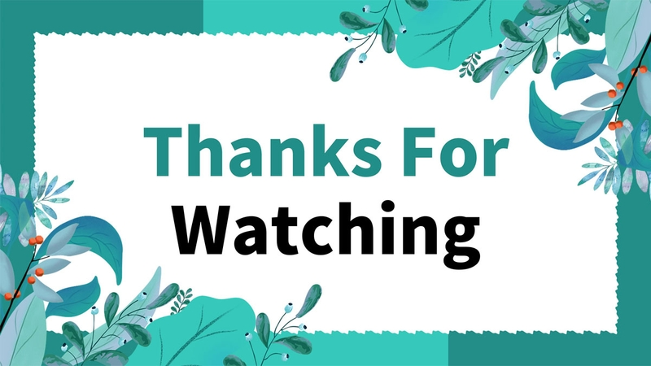

<div align="center">
  <h1>🎬 HỆ THỐNG QUẢN LÝ RẠP PHIM</h1>
  <p><b>Dự án phần mềm quản lý rạp phim trên desktop với kiến trúc hiện đại, mạnh mẽ!</b></p>

[](https://www.oracle.com/java/)
[](https://www.mysql.com/)
[](https://hibernate.org/)
[](https://maven.apache.org/)

</div>

---

## 👥 THÀNH VIÊN THỰC HIỆN

| STT | Họ và Tên               | Mã số sinh viên |
| :-: | :---------------------- | :-------------: |
|  1  | **Trác Ngọc Đăng Khoa** |   `23110243`    |
|  2  | **Nguyễn Trí Lâm**      |   `23110250`    |
|  3  | **Lâm Văn Dỉ**          |   `23110191`    |

---

## 🌟 1. Giới thiệu đề tài

Đây là dự án xây dựng phần mềm quản lý rạp phim chạy trên **desktop**, phát triển bằng **Java Swing**, tổ chức theo mô hình **MVC phân lớp** và sử dụng **Hibernate/JPA** để làm việc với cơ sở dữ liệu **MySQL**.

**Hệ thống hỗ trợ các nhóm nghiệp vụ chính:**

- 🔐 Đăng nhập và phân quyền người dùng
- 🎫 Bán vé tại quầy (chọn suất chiếu, chọn ghế, checkout)
- 💳 Quản lý thanh toán và hóa đơn
- 🎞️ Quản lý phim, suất chiếu, phòng chiếu, ghế, loại ghế
- 🍿 Quản lý sản phẩm F&B và khuyến mãi
- 👥 Quản lý khách hàng, điểm tích lũy
- 📊 Báo cáo ca và nhật ký hệ thống

---

## 🛠️ 2. Công nghệ sử dụng

- **Ngôn ngữ:** Java 17
- **Giao diện:** Java Swing kết hợp FlatLaf (UI theme hiện đại)
- **Quản lý dependencies:** Maven
- **Cơ sở dữ liệu:** MySQL 8+
- **ORM:** Hibernate ORM / JPA (Jakarta Persistence)
- **Tiện ích:** Lombok

---

## 🏗️ 3. Kiến trúc hệ thống

Dự án được tổ chức theo kiến trúc phân lớp chuẩn xác:

- 🎨 **View**: các màn hình giao diện Swing (`view/**`)
- 🕹️ **Controller**: điều phối thao tác UI đến nghiệp vụ (`controller/**`)
- ⚙️ **Service**: xử lý logic nghiệp vụ (`service/**`, `service/impl/**`)
- 🗄️ **Repository**: truy xuất dữ liệu qua JPA (`repository/**`)
- 📦 **Entity**: ánh xạ đối tượng với bảng dữ liệu (`model/entity/**`)

> 💡 _Việc tách lớp giúp hệ thống dễ bảo trì, dễ mở rộng và giảm phụ thuộc trực tiếp giữa giao diện với dữ liệu._

---

## 🚀 4. Chức năng chính

### 🔐 4.1. Xác thực và phiên làm việc

- Đăng nhập hệ thống
- Quản lý ngữ cảnh người dùng hiện tại (session context)
- Phân quyền theo vai trò trong vận hành

### 🎫 4.2. Bán vé tại quầy

- Tra cứu phim và suất chiếu
- Hiển thị sơ đồ ghế theo phòng chiếu linh hoạt
- Chọn ghế, khóa ghế tạm thời và xử lý checkout
- Tạo hóa đơn và chi tiết vé

### 💳 4.3. Quản lý thanh toán và hóa đơn

- Tạo giao dịch thanh toán theo phương thức hỗ trợ
- Theo dõi trạng thái thanh toán
- Quản lý danh sách hóa đơn
- Hỗ trợ các luồng xử lý sau thanh toán

### 🏢 4.4. Quản lý danh mục rạp

- Quản lý danh sách, thể loại Phim
- Quản lý Lịch chiếu / Suất chiếu
- Quản lý Phòng chiếu
- Quản lý sơ đồ Ghế và Loại ghế

### 🎁 4.5. Quản lý khách hàng, điểm và khuyến mãi

- Quản lý thông tin khách hàng thân thiết
- Tích điểm / sử dụng điểm thưởng
- Áp dụng mã khuyến mãi theo nhiều điều kiện khác nhau

### 📊 4.6. Vận hành và kiểm soát

- Quản lý báo cáo ca làm việc của nhân viên
- Xem lịch sử giao dịch, thanh toán
- Nhật ký thao tác hệ thống (Audit log) để track hoạt động

---

## 📂 5. Cấu trúc thư mục chính

```text
📁 src/
├─ 📂 main/
│  ├─ 📂 java/com/cinema/management/
│  │  ├─ 📁 controller/
│  │  ├─ 📁 service/
│  │  ├─ 📁 repository/
│  │  ├─ 📁 model/
│  │  └─ 📁 view/
│  └─ 📂 resources/META-INF/
│     └─ 📄 persistence.xml
├─ 📂 database/
│  ├─ 📜 create_database.sql
│  └─ 📜 insert_sample_data.sql
└─ 📂 doc/
```

---

## ⚙️ 6. Hướng dẫn tạo cơ sở dữ liệu

**Bước 1: Tạo schema và dữ liệu mẫu**
Chạy lần lượt 2 script trong thư mục `src/database` trên MySQL:

1. `create_database.sql`
2. `insert_sample_data.sql`

**Bước 2: Cấu hình kết nối JPA**
Mở file `src/main/resources/META-INF/persistence.xml` và cập nhật thông tin MySQL (URL, username, password) cho phù hợp với máy local của bạn.

---

## ▶️ 7. Hướng dẫn chạy project

### 📌 Yêu cầu hệ thống (Prerequisites)

- **JDK 17**: Cần cài đặt Java 17 và thiết lập biến môi trường `JAVA_HOME`.
- **MySQL Server**: Đã cài đặt và dịch vụ MySQL đang chạy.
- **Maven**: (Tùy chọn) Chỉ cần khi chạy bằng dòng lệnh. IDE đã tích hợp sẵn.

### 🚀 Cách 1: Chạy bằng IntelliJ IDEA (Khuyến nghị)

Đây là cách nhanh chóng và dễ dàng nhất:

1. Mở IntelliJ IDEA, chọn **Open** và trỏ tới thư mục chứa file `pom.xml`.
2. Mở cửa sổ công cụ **Maven** (thường nằm ở cạnh phải màn hình), nhấn biểu tượng **Reload All Maven Projects** để tải toàn bộ thư viện.
3. **Rất quan trọng:** Đảm bảo bạn đã hoàn thành thiết lập Database ở **Bước 6**.
4. Tìm đến file chạy chính theo đường dẫn: `src/main/java/com/cinema/management/App.java`.
5. Click chuột phải vào màn hình code `App.java` và chọn **Run 'App.main()'**.
6. _(Lưu ý)_: Nếu code báo đỏ hãy vào `File -> Project Structure -> Project` và chọn phiên bản JDK đúng là Java 17.

### 💻 Cách 2: Chạy bằng Dòng lệnh (Terminal)

Nếu bạn không dùng IDE, hãy làm theo cách sau:

1. Mở Terminal / Command Prompt và `cd` đến thư mục gốc của project (nơi có file `pom.xml`).
2. Gõ lệnh tải dependency và biên dịch toàn bộ cấu trúc:
   ```bash
   mvn clean install
   ```
3. Chạy project:
   ```bash
   mvn exec:java -Dexec.mainClass="com.cinema.management.App"
   ```

---

## 🔑 8. Tài khoản mẫu

Bộ dữ liệu chuẩn (`insert_sample_data.sql`) có sẵn các tài khoản sau để bạn test ngay:

| Vai trò                   | Username  | Password |
| :------------------------ | :-------- | :------- |
| **Quản trị viên (Admin)** | `admin`   | `123456` |
| **Nhân viên (Staff)**     | `staff01` | `123456` |
| **Nhân viên (Staff)**     | `staff02` | `123456` |

---

## 🛡️ 9. Phân quyền

Hệ thống quản lý quyền truy cập chặt chẽ theo các vai trò (`ROLE_ADMIN`, `ROLE_STAFF`). Tùy vào tài khoản đăng nhập mà giao diện hiển thị các chức năng cho phép điều hướng tương ứng.

---

## 📐 10. UML và tài liệu phân tích

Thư mục `diagrams/` chứa các sơ đồ UML (sử dụng PlantUML) cho quá trình phân tích thiết kế, bao gồm:

- Sơ đồ **Activity**
- Sơ đồ **Sequence** biểu diễn các luồng nghiệp vụ.

---

## 📋 11. Phân công nhóm chi tiết

📝 **Trác Ngọc Đăng Khoa** (Hệ thống lõi & Vận hành POS)

- **Module phụ trách**: Core rạp chiếu + POS bán vé + Thanh toán/Xuất vé.
- **Công việc chính**:
  - Xây dựng nghiệp vụ cho `Room`, `SeatType`, `Seat`, `ShowTime`.
  - Phát triển giao diện sơ đồ ghế (Grid Layout).
  - Xử lý luồng chọn ghế và khóa ghế `SeatLock` trong 15 phút.
  - Triển khai `Invoice`, `BookingSeat`, `OrderDetail`, `Payment`.
  - Tính tổng tiền vé + F&B, lưu snapshot giá tại thời điểm bán.

📝 **Nguyễn Trí Lâm** (Quản trị, CRM & Cấu hình nghiệp vụ)

- **Module phụ trách**: Phim/F&B + Khách hàng/Khuyến mãi + Phân quyền/Audit.
- **Công việc chính**:
  - Phát triển CRUD Admin cho `Movie`, `Genre`, `Product`.
  - Triển khai `Customer`, `PointHistory`, `Promotion`.
  - Xử lý logic tích điểm 5%, nâng hạng thành viên (tier), kiểm tra mã promo hợp lệ.
  - Xây dựng `User`, `Role`, `AuditLog`, form đăng nhập và luồng Admin tạo tài khoản Staff.

📝 **Lâm Văn Dỉ** (Thiết kế hệ thống dữ liệu & Tầng truy xuất)

- **Module phụ trách**: UML + Database + JPA + Repository.
- **Công việc chính**:
  - Thiết kế và đồng bộ sơ đồ UML (Use Case, Activity, Sequence, Class).
  - Thiết kế CSDL và script `create_database.sql`, `insert_sample_data.sql`.
  - Chuẩn hóa mapping Entity JPA, quan hệ khóa chính/khóa ngoại.
  - Triển khai các lớp Repository dùng chung.
  - Rà soát nhất quán giữa UML ↔ DB ↔ Entity ↔ Repository.

---

## ✨ 12. Điểm nổi bật

- ✅ **Kiến trúc phân lớp rõ ràng**, bám sát mô hình MVC.
- ✅ **JPA/Hibernate** giúp thao tác dữ liệu chuẩn xác, tiện lợi.
- ✅ **Bao phủ trọn vẹn nghiệp vụ POS**: chọn ghế, checkout, thanh toán, hóa đơn.
- ✅ **Khối quản trị đầy đủ**: danh mục rạp, khuyến mãi, khách hàng, nhân sự.
- ✅ **Khả năng tracking tốt** với Audit Log.

---

## 🔮 13. Hướng phát triển trong tương lai

- 💡 Hoàn thiện **Dependency Injection** (như Spring Core) để quản lý Bean chuyên nghiệp hơn.
- 💡 Tích hợp **cổng thanh toán online** (MoMo, VNPay, ZaloPay).
- 💡 Bổ sung **Unit Test / Integration Test** cho tự động hóa kiểm thử.
- 💡 Nâng cấp **Dashboard Thống kê** dạng biểu đồ động.

---

<p align="center"><i>Cảm ơn đã xem qua dự án của nhóm chúng tôi! ❤️ </i></p>

<p align="center"></p>
